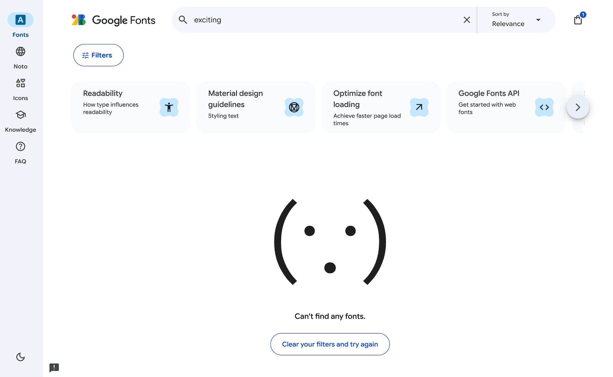
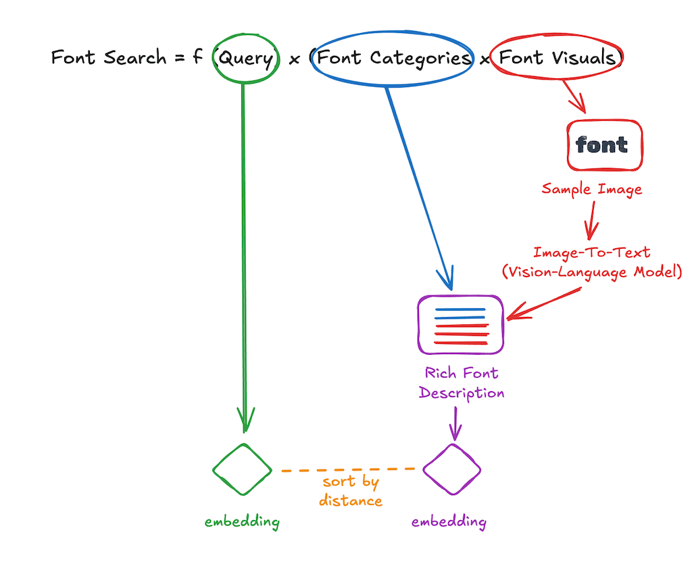
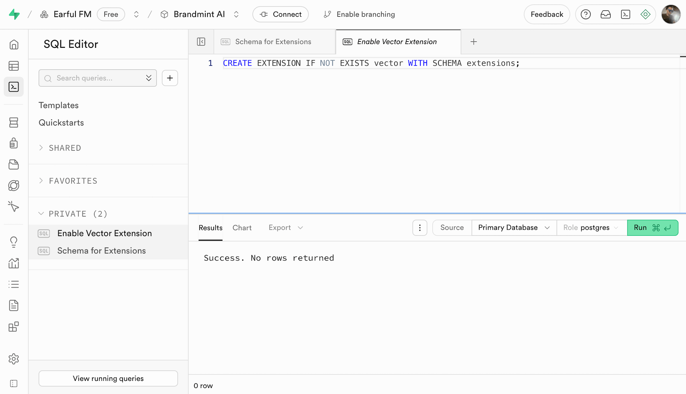
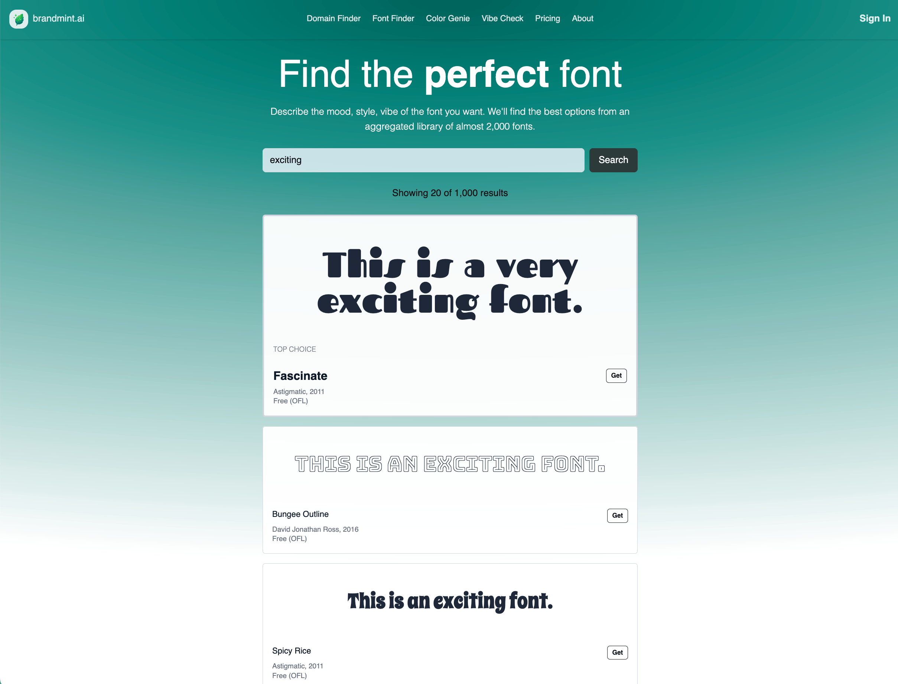

# Using Vision Language Models to Index and Search Fonts

### Aka: How to build a font search engine using Google Fonts, Supabase, and Mistral

Over the last few weeks the most requested feature on brandmint has been for a "font finder".

The use case: you're creating a website or logo and you need a font that captures something abstract like "silent sophistication" or "crisp clean with a little bit of soul". You can click around on Google Fonts, but the search function there seems to expect you to know the names of the fonts. You don't know the names of the fonts, that's why you're searching!

This is a nice search problem. The solution looks something like this:


There are plenty of ways to skin this cat, many of them decades old, so I was a bit surprised to find that Google Fonts hasn't made any effort to solve this. If you're looking for an "exciting" font there, this is what they'll tell you:



They can't find any exciting fonts?!

Don't believe them, there many exciting fonts out there! A _great_ solution would include usage data and a wide catalog, but as an immediate exercise we can use new - or newly cheap - AI services to come up with a _good_ solution and solve this problem.



The most notable part of this is being able to send a picture of some text to a VLM and have it describe the qualities of the font with reasonable success. From there, it's just a question of packaging up the everything into embeddings and using vector search.

Sidenote I: This cookbook will assume you know your way round embeddings and the like. If you're new to vector search check out my guide on how to [build your own color search engine](https://lui.ie/guides/semantic-search-colors) which is a bit more beginner-friendly.

Sidenote II: Strictly speaking we're not talking about fonts (e.g. Arial Italic Size 15) or typefaces (e.g. Arial Italic), but _families of typeface_ (e.g. Arial). But the distinction has blurred over time and "fonts" just rolls off the tongue more easily, so I'll use that term throughout this guide.

I did look more widely for a vector-based / semantic search for fonts and couldn't find a live example anywhere online. I found a font search website discussed on Reddit but that site has since gone defunct, so presumably the demand here is pretty light. Still, a few people have asked for it so I've added it to Brandmint.

The finished product, which I called Font Finder, is here:

https://brandmint.ai/font-finder

And here's how I built it, and how you too can build your own!

## Step 0 - Understand how the source data is organized

For this font search engine the source data is from [the github repo for Google Fonts](https://github.com/google/fonts), which is licensed under various permissive licenses.

### Repo Structure

The fonts in this project are organized by license type.

- `ofl/` – Fonts under the SIL Open Font License 1.1. This is the majority of fonts on Google Fonts
- `apache/` – Fonts under the Apache License 2.0
- `ufl/` – Fonts under the Ubuntu Font License 1.0 (used mainly by the Ubuntu font family)

There are lots of other folders that seem promising but are distractions for our simple build. If you're curious:

- `tags/` - Contains classification tags for fonts. This might well help in classifying our fonts, but I found I didn't need it and omitted it to keep things simple.
- `axisregistry/` - Downstream version of a Google repo which defines deeper variable support for some fonts.
- `lang/` – Downstream version of a Google repo that contains data on languages, scripts, and regions used to classify fonts’ language support on Google Fonts.
- `cc-by-sa/` - Educational material for the Google Fonts website.
- `catalog/` - Background info on specific font designers.

### Structure Within Font Folders

Within each of the three important license directories (`ofl/`, `apache/`, `ufl/`), font families are organized by family name. Each family has its own subfolder named after the font family. Folder naming conventions for families generally use lowercase letters and no spaces or special characters (often just removing spaces from the font's name). For example, "Open Sans" is found in `ofl/opensans/`.

Each font family folder typically contains:

- FontFamily-Style.ttf - The actual font binaries for each style

  - Static fonts look like `FontFamily-Bold.ttf` etc
  - Variable fonts follow the convention `FontFamily[wdth,wght].ttf` with the values in brackets indicating which axis tags are supported

- METADATA.pb: Machine-readable metadata including:

  - Family name and available styles
  - Designer/foundry info
  - License type
  - Category (Sans-serif, Serif, Display, etc.)
  - Language/script support
  - Version info
  - **This is the main data source for building our index!**

- DESCRIPTION.en_us.html: English description of the font family, typically a paragraph or two about its history and design.

  - Some of these descriptions are quite sweet.
    - "Maiden Orange is a light and festive slab serif font inspired by custom hand lettered 1950s advertisements."
    - "Kosugi is a Gothic design, [...] it evokes the Japanese cedar trees that have straight and thick trunks and branches."
  - Sometimes there is no description doc, or it is present but blank. In those cases we will seek out a fallback document of `article/ARTICLE.en_us.html`

- LICENSE.txt: The full license text (may be OFL.txt, UFL.txt depending on license type). These are all standardized based on parent folders, so for our purpose just the descriptor of the license from METADATA.pb should be sufficient.

There seems to be some variance between folders, but the vast majority of folders I explored had the above structure, so that should be enough for us to work with.

## Step 1 - Create Your Postgres Database and Add Vector Extension

If this is a new project:

Supabase > new project > follow the flow to create a new PostgreSQL

If this your the first table in your database using vectors, you'll need to add the vector extension. In the SQL Editor: choose New SQL Snippet (Execute SQL Queries)

There are two queries to run here:

```sql
CREATE SCHEMA IF NOT EXISTS extensions;

CREATE EXTENSION IF NOT EXISTS vector WITH SCHEMA extensions;
```



## Step 2 - Create a Table in the Database

Even though you've just added the `extensions` schema to support vectors, the `fonts` table itself will live in the `public` schema.

Supabase does have a UI for creating a new Table but it doesn't let you specify vector size, so you'll need to do this with a SQL command.

For your font data keep it as tight as you can while still providing a good search experience. Sketch out what you want...

- id (number is good for us here)
- created_at (timestamp defaulting to now - may be useful later if expanding the list)
- name (unique string - we don't want duplicate names pointing at different fonts)
- url (string)
- designer (string)
- year (number - just the year when the font was added to Google Fonts)
- license (string)
- copyright (string)
- category (string e.g. MONOSPACE | DISPLAY)
- stroke (string e.g. SANS_SERIF | SERIF | SLAB_SERIF)
- ai_descriptors (string array)
- description_p1 (string - just the first paragraph from the description html docs)
- summary_text_v1 (string - this is what we'll transform into a vector)
- embedding_mistral_v1 (vector with 1024 dimensions)

And then use an LLM to convert it to SQL:

```sql
CREATE TABLE public.fonts (
    id BIGSERIAL PRIMARY KEY,
    created_at TIMESTAMP WITH TIME ZONE DEFAULT NOW(),

    name TEXT UNIQUE NOT NULL,
    url TEXT,
    designer TEXT,
    year INTEGER,
    license TEXT,
    copyright TEXT,

    category TEXT,
    stroke TEXT,
    ai_descriptors TEXT[],
    description_p1 TEXT,
    summary_text_v1 TEXT,
    embedding_mistral_v1 VECTOR(1024)
);
```

Sidenote III: It's a pity we have to treat each typeface family as a single unit. Typically a family will support a number of different "weights". Each weight can be described with a number (e.g. "700") or a word (e.g. "Bold"). The number is standardized in the CSS Fonts specification for `font-weight`, it's not a direct measurement of anything. This gives designers precise control over font weight across, and will be a vital part of a font selection in the wild.

- Thin 100
- ExtraLight 200
- Light 300
- Regular 400
- Medium 500
- SemiBold 600
- Bold 700
- ExtraBold 800
- Black 900

If you're looking for the perfect font there will be times when the answer is ExtraLight Arial and some very different times when the answer is ExtraBold Arial. That said, we have to simplify somewhere. If there's user demand for more granular entries they can always be added in a future version.

## Step 3 - Pull in the data source

The Google Fonts repo on GitHub has all the data we need. We're going to start by cloning that repo locally.

```sh
git clone https://github.com/google/fonts.git
```

This will occupy 5.6 GB of storage on your machine.

## Step 4 - Connect our codebase to Mistral

For this project I'm using Mistral models throughout and coding with with TypeScript.

First I create a simple client object to call Mistral:

```ts
import { Mistral } from "@mistralai/mistralai";

const apiKey = process.env.MISTRAL_API_KEY;

if (!apiKey) {
  throw new Error("MISTRAL_API_KEY is not set");
}

export const clientMistral = new Mistral({ apiKey });
```

Then a function to call it:

```ts
import { clientMistral } from "../connections/clientMistral";

const getEmbeddings = async (inputs: string[]): Promise<string[]> => {
  const response = await clientMistral.embeddings.create({
    model: "mistral-embed",
    inputs: inputs,
  });

  const outputs = response.data;

  const validOutputs = outputs.filter(
    (output) => output.object === "embedding" && output.index !== undefined
  );
  return validOutputs.map((output) => JSON.stringify(output.embedding));
};
```

Then a super simple script that calls the function:

```ts
const testRun = async () => {
  const embeddings = await getEmbedding(["red"]);
  const testEmbedding = embeddings[0];
  console.log(testEmbedding);
  console.log(testEmbedding.length);
};

testRun();
```

To run this, I use `bun`. So the Terminal command is:

```sh
bun src/script.ts
```

## Step 5 - Connect our codebase to Supabase

To connect your code with Supabase find your Project ID (find this in `Settings > General > Project Settings`).

It will look something like this: `abcdefghijklmnopqrst`

Your .env file will need a `SUPABASE_URL`, which will be built around the Project ID using this format:

`https://abcdefghijklmnopqrst.supabase.co`

Your `SUPABASE_SERVICE_ROLE_KEY` is a longer string that you'll find in `Settings > API Keys > Reveal`.

Here's the code to create your Supabase client on the server:

```ts
import { createClient } from "@supabase/supabase-js";
import { Database } from "../types/supabase";

const supabaseUrl = process.env.SUPABASE_URL;
const supabaseKey = process.env.SUPABASE_SERVICE_ROLE_KEY;

if (!supabaseUrl || !supabaseKey) {
  throw new Error("SUPABASE_URL or SUPABASE_SERVICE_ROLE_KEY is not set");
}

export const clientSupabase = createClient<Database>(supabaseUrl, supabaseKey);
```

Supabase gives you an npx script for generating a types file. Here's how to use it:

1. `npm i supabase`
2. `npx supabase login`
3. Follow the login flow in your browser
4. Generate TypeScript types: `npx supabase gen types typescript --project-id abcdefghijklmnopqrst > types/supabase.ts`

Save that script as a comment in your .env file, you will use it a ton!

## Step 6 - Define what DB-ready data looks like

Our `types/supabase.ts` file makes it nice and clear what shape our data needs to be in. So our target state is:

```ts
type FontDBReady = {
  name: string;
  category: string | null;
  copyright: string | null;
  designer: string | null;
  license: string | null;
  stroke: string | null;
  year: number | null;
  url: string | null;
  description_p1: string | null;
  ai_descriptors: string[];
  summary_text_v1: string | null;
  embedding_mistral_v1: string;
};
```

So if we can get our data objects to look like that, we can save them into our database with a super simple `upsert(font, { onConflict: "name" })` command without any mapping of parameters.

However, to assemble this data we need to collect info from a few different places. I like to reflect this in the type structure. It's like we're assembling a car, and the car has to pass through a few stations. At the first station we expect a certain set of pieces to be bolted together. That core will then be passed to the next station which will bolt on some extras, and so on until the car is complete.

In our case, there are three stations:

1. All the text data from the Metadata.pb file
2. That text plus any other data we can derive from html files, plus an AI assessment of a picture of text written in that font, all packaged ready to fetch an embedding
3. The above package with the embedding added to it

```ts
/** Everything here comes from METADATA.pb*/
type FontBasics = {
  name: string;
  category: string | null; // include classifications here, space separated if multiple
  copyright: string | null; // Find this in fonts[0]
  designer: string | null;
  license: string | null;
  stroke: string | null;
  year: number | null; // Just use first four digits of date_added
};

type FontEmbeddingReady = FontBasics & {
  url: string | null; // Can be constructed from name, separated by +, e.g.: https://fonts.googleapis.com/css2?family=Family+Name
  description_p1: string | null; // Take the first <p> element of DESCRIPTION.en_us.html
  ai_descriptors: string[]; // List of adjectives from multimodal AI assessment of visual
  summary_text_v1: string | null; // Combination of all relevant descriptive elements. This is what we will vectorize.
};

type FontDBReady = FontEmbeddingReady & {
  embedding_mistral_v1: string;
};
```

## Step 7 - Assemble the FontBasics object

My full ETL script can be found here:

https://github.com/yablochko8/semantic-search-fonts/blob/main/src/script.ts

I've kept it heavily commented so if you're following this guide with the exact same source data now is the time to dive into that code.

Assembling the FontBasics object is cheap, easy, and all local.

Key parts:

1. Basic validation - confirm the font is not on an exclusion list (we don't want notation fonts like jsmath) and that all the expected files are present
2. parseFontBasicsFromPb - gets the basic text values from the `METADATA.pb` file
3. parseP1FromHtml - I just a short description for each font, so I'm taking the text of the first `<p>` value I can find in either `DESCRIPTION.en_us.html` or inside `article/ARTICLE.en_us.html`

## Step 8 - Add in the vital ingredient: AI assessment of a picture of the font text, and assemble a FontEmbeddingReady object

For my first pass at this I thought I could rely on the text descriptions, but the descriptions sometimes gave offbeat results.

(If you're curious I've left this version live on Brandmint, just select Algorithm: V1)

To get more standardized assessment, our function flow will look like this:

1. generateSamplePng - take in a TTF file and spit out the buffer of a representative image in that font. We keep it as a buffer, that's the format we'll want it in to pass it to any external AI provider.
2. getDescriptors - pass the image buffer to a multimodal AI model (I used Mistral's `pixtral-12b`)
3. getSummaryTextSimple - package all the information we know into a single summary describing the font in consistent terms. My first pass at this was basically: `${name} is a ${adjectives} font designed by ${designer} in ${year}. ${p1Description}`

## Step 9 - Transform summary into text that is well suited to embedding

I didn't expect to need this step but here's the problem, sometimes the name of a font is hugely useful ("Orbitron" font is nice and futuristic) and sometimes it's hugely unhelpful ("Are you serious" is decidedly not serious, but elevates the joky font to the top of results for a "serious" query). We can let an LLM figure this out.

Good text for embedding should be as descriptive and information-rich as possible, focusing on the essential characteristics of the item you want to represent. We want to avoid negations (e.g., "not serious") as they confuse embedding models. The text should only specify what the font _is_ rather than what it is not. The ideal is a comma-separated list or a short, well-structured paragraph. We can also include the font's name and designer if they're relevant and not misleading.

## Step 10 - Get an embedding of your text

We pass our embedding-ready text, which I call "summaryTextAdvanced" to our getEmbeddings function, and store the resulting vector in our `embedding_mistral_v1` field. Supabase expects

## Step 11 - Save our fonts to the database

Usually for an ETL we would run some test writes of full data, but given that there are fewer than 2,000 entries it's such a small dataset that it seemed silly to split it out. So at this point we just run the full ETL script,

## Step 12 - Enjoy the fact that we DON'T need to create an index

Because there are fewer than 10,000 entries in this data, we definitely do not need to create an index.

We should get exact results within a few milliseconds. An index would complicate our code and only give us slightly less accurate results.

If you're dealing with a larger dataset, you can see more details on adding an index in [my previous guide](https://lui.ie/guides/semantic-search-colors).

## Step 13 - Create an RPC Function to search by embedding

Usually when we want to call a Supabase database from code we use the Supabase SDK, and that will have predefined functions to let you add, delete, update etc.

However, calling for results sorted by embedding distance is beyond the scope of their current SDK, so we'll need to create our own custom function that we can call in a controlled way.

This is called an RPC (Remote Procedure Call) Function.

For our needs, we're going to want to query the embedding column, and get results back with `name`, `hex`, and `is_good_name` fields. We don't need to specify the index we're calling, as there should be only one for that column.

Here's the code for creating the function:

```sql
CREATE OR REPLACE FUNCTION search_embedding_mistral_v1(
  query_embedding vector(1024),
  match_count int default 10
)
RETURNS TABLE (
  name text,
  category text,
  copyright text,
  designer text,
  license text,
  stroke text,
  year integer,
  url text,
  description_p1 text,
  distance float
)
LANGUAGE sql STABLE
AS $$

  SELECT
    c.name,
    c.category,
    c.copyright,
    c.designer,
    c.license,
    c.stroke,
    c.year,
    c.url,
    c.description_p1,
    c.embedding_mistral_v1 <#> query_embedding AS distance
  FROM (
    SELECT * FROM fonts
    ORDER BY embedding_mistral_v1 <#> query_embedding
    LIMIT match_count
  ) c;
$$;
```

For the curious:

`language sql stable` - This tells Postgres that this is a SQL function that will always return the same output for the same inputs, as long as the underlying data hasn't changed. Unlike 'volatile' functions which may return different results even with identical inputs, 'stable' functions are deterministic within a single query. This allows Postgres to optimize the function calls better, since it knows the results will be consistent for the same parameters within a transaction.

## Step 14 - Update your types file

We're going to call this named function from our code, so we want Intellisense to expect it. We run the command that we created in Step 5 above.

```sh
npx supabase gen types typescript --project-id YOUR_PROJECT_ID > src/types/supabase.ts
```

## Step 15 - Run a Test Query

Remember we can't query directly using the query string, we need to convert it into an embedding and query with the embedding.

```ts
const testQuery = async () => {
  const testEmbedding = await getEmbedding("punk eleganza");
  const { data, error } = await clientSupabase.rpc(
    "search_embedding_mistral_v1",
    {
      query_embedding: JSON.stringify(testEmbedding),
      match_count: 10,
    }
  );
};
```

Sure enough, a query for "punk eleganza" gives us the named font "Belleza".

I'm sure I don't need to tell you that "Belleza is a humanist sans serif typeface inspired by the world of fashion. With classic proportions, high contrast in its strokes and special counters, it provides a fresh look that reminds readers of elegant models and feminine beauty."

https://fonts.google.com/specimen/Belleza

Serving up sans serif realness, success!

And of course to if we're looking for something exciting, we have now have the entire catalog ranked by exciting-ness:



## Step 16 - Integrate with Frontend

Integrating with a production service is fairly straightforward, the server code matches the pattern of a testQuery above.

On the frontend, the only novel piece here really is having to load lots of fonts dynamically on the fly.

Here's what that looks like in React:

1. We trigger a `useEffect` hook when the `font.url` loads
2. Inside the effect, we dynamically create a `<link>` element to load the font CSS
3. Add in error handling and a cleanup function to remove the link when the component unmounts
4. In the JSX, render the loaded font (or a system fallback)

The code below shows the implementation:

```ts
useEffect(() => {
  const loadFont = async () => {
    try {
      // Create a link element to load the font
      const link = document.createElement("link");
      link.href = font.url;
      link.rel = "stylesheet";
      link.type = "text/css";

      // Wait for the font to load
      link.onload = () => {
        setFontLoaded(true);
      };

      link.onerror = () => {
        console.error("Failed to load font:", font.name);
        setFontLoaded(true); // Still set to true to show fallback
      };

      document.head.appendChild(link);

      // Cleanup function
      return () => {
        document.head.removeChild(link);
      };
    } catch (error) {
      console.error("Error loading font:", error);
      setFontLoaded(true); // Show fallback
    }
  };

  loadFont();
}, [font.url]);
```

Then inject the name into the JSX...

```jsx
<div
  style={{
    fontFamily: fontLoaded ? font.name : "system-ui, sans-serif",
  }}
>
  {fontLoaded ? displayText : "Loading font..."}
</div>
```

## Other notes

- This took much longer to build than the color search engine from last week, a reminder that the hardest piece of work to optimize is understanding a new dataset.
- Cost breakdown:
  - €0.17 mistral-embed (text embedding)
  - €0.70 mistral-medium-latest (LLM for text transformation)
  - €0.64 pixtral-12b (VLM / multimodal LLM for image characterization)

Total = €1.51

I probably could have indulged in larger models.

## Links

### Embedding Models

- [Mistral](https://docs.mistral.ai/capabilities/embeddings/overview/)

### More Reading

- [Distance Metrics](https://chrisloy.dev/post/2025/06/30/distance-metrics)
- [Semantic Search](https://supabase.com/docs/guides/ai/semantic-search)
- [Build your own Color Search Engine](https://lui.ie/guides/semantic-search-colors)

### Try It Out

If you've scrolled to the end and just want to search for fonts, jump over to the [Font Finder on brandmint.ai](https://brandmint.ai/font-finder)
